# Changelog

All notable changes to disinfo, an LED matrix dashboard: it (dis)plays (info)rmation.

The format follows [Keep a Changelog](https://keepachangelog.com/en/1.1.0/). Versions are dates (`YYYY.MM.DD`). The milestones are the days a demo GIF or screenshot was committed (📸). Each shows a frame from it, with a link to the full GIF at that commit. Hardware changes are marked 🔧.

- Repository: [prashnts/disinfo](https://github.com/prashnts/disinfo)
- Branches: [`master`](https://github.com/prashnts/disinfo/tree/master), [`llm-v1`](https://github.com/prashnts/disinfo/tree/llm-v1) (current)

## Milestones

| Date | Milestone |
|---|---|
| 2023-04-12 | First code: weather and random facts on a HUB75 panel |
| 2023-04-22 | 📸 First demo shot |
| 2023-05-27 | 📸 GIF renderer; Paris Metro and Game of Life backgrounds |
| 2023-05-30 | 🔧 Raspberry Pi 4 |
| 2023-06-19 | Renamed `disp_info` → `disinfo` |
| 2023-07-21 | Web server; pub/sub state over Redis |
| 2023-09-09 | 📸 Solar clock |
| 2023-11-05 | Card stack and web UI |
| 2024-04-13 | 📸 Appliances: dishwasher, washing machine |
| 2024-05-25 | 🔧 Panels driven by Pico W over UDP |
| 2024-06-16 | Aviator: ADS-B flights and radar map |
| 2025-09-27 | 🔧 WebSocket HUB75 client; portrait 128×192 salon panel |
| 2025-10-19 | 🔧 Remote with sensors, telemetry back to the server |
| 2026-02-21 | 📸 Portrait layout; Home Assistant over WebSocket |
| 2026-07-15 | **First use of AI**: `find_sequences`, written by local LLMs from a prompt |
| 2026-08-15 | 📸 Photo of the panel on the wall |
| 2026-09-27 | `discore` library extracted (`llm-v1`, AI-assisted) |
| 2026-10-01 | 📸 GIF renderer timed correctly |

---

## [Unreleased] - `llm-v1`

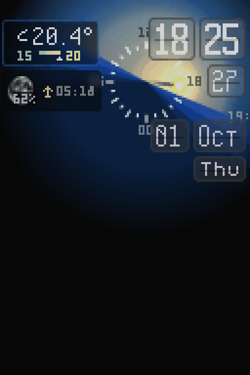

📸 [`assets/disinfo-export.gif`](assets/disinfo-export.gif), rendered 2026-10-01: 10 s at 25 fps, after a 20 s warm-up, at real speed.

Branch [`llm-v1`](https://github.com/prashnts/disinfo/tree/llm-v1), created 2026-09-27 from [`299bdf0`](https://github.com/prashnts/disinfo/commit/299bdf0). The work on this branch is AI-assisted (Claude Code).

### Added
- Music slides, with album art cached and a Spotify mark ([`6ce6bbb`](https://github.com/prashnts/disinfo/commit/6ce6bbb)). Listening sessions (`utils/sessions.py`, [`d2d38aa`](https://github.com/prashnts/disinfo/commit/d2d38aa)).
- GIF renderer: `--fps` and `--warmup` options (uncommitted).
- Docker image (`Dockerfile`, [`3c93d89`](https://github.com/prashnts/disinfo/commit/3c93d89)): `app` target, and a `demo` target with Redis and the sample config in one container ([`d0297a8`](https://github.com/prashnts/disinfo/commit/d0297a8)). Fonts are fetched at build time, not on every container start, and Noto Color Emoji is installed from apt so `render_emoji` draws real emoji instead of a fallback box (uncommitted).

### Changed
- **`discore`**: the layout, text, scroller, sprite, stack, transition and widget components moved into their own package, `libs/discore`, with tests ([`e07faf9`](https://github.com/prashnts/disinfo/commit/e07faf9)).
- **Docker images are built when a `v*` tag is pushed**, no longer on every push to `master`. A tag `vX` publishes `ghcr.io/prashnts/disinfo:X` and `:latest`, and `:X-demo` and `:demo`. The per-commit `sha` tags are gone (uncommitted).
- CI is split: `test.yml` runs the `discore` tests on every push, and `docker.yml` runs the full app tests (and a render smoke test) before building (uncommitted).
- The MJPEG stream is decoded in `utils/mjpeg.py`, with a lighter printer card ([`beb38c2`](https://github.com/prashnts/disinfo/commit/beb38c2)).

### Fixed
- CI tests: `apt-get update` before installing system libraries, fonts fetched once before the render smoke test, the smoke test waits for the server instead of sleeping 5 s, and stops it afterwards. A server left running held the uv cache lock and hung the job's post-step for minutes (uncommitted).
- GIF renderer timing (uncommitted). Each frame now lasts as long as it took on the wall clock, in milliseconds. The delays used to be passed as `durations=` (which Pillow ignores) and were computed in seconds ÷ 1000, so every GIF from 2023 to 2026 has 0–10 ms frames and plays too fast.

## [2026.08.15] - The panel on the wall

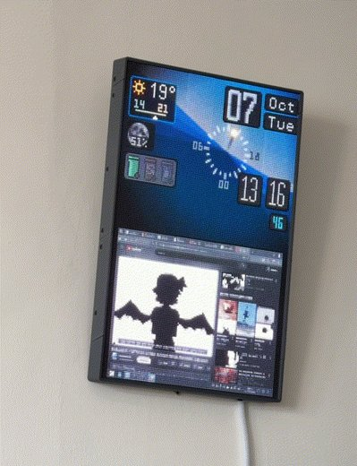

📸 [`output-di.gif`](https://github.com/prashnts/disinfo/blob/605e3ea/assets/output-di.gif) ([`605e3ea`](https://github.com/prashnts/disinfo/commit/605e3ea)), a recording of the real panel.

### Added
- GIF support in sprites, and Nyan Cat on 22:22 ([`dd84b90`](https://github.com/prashnts/disinfo/commit/dd84b90), [`d2e20b0`](https://github.com/prashnts/disinfo/commit/d2e20b0), [`b388aea`](https://github.com/prashnts/disinfo/commit/b388aea)).
- Printer camera stream in the card ([`a241cf7`](https://github.com/prashnts/disinfo/commit/a241cf7)).
- News highlights ([`05946bd`](https://github.com/prashnts/disinfo/commit/05946bd)) and datetime highlights ([`a63ef90`](https://github.com/prashnts/disinfo/commit/a63ef90)). Time-sequence prompt ([`ec842df`](https://github.com/prashnts/disinfo/commit/ec842df)).

> **First use of AI in disinfo** (2026-07-15, [`a63ef90`](https://github.com/prashnts/disinfo/commit/a63ef90)). The datetime highlights' `find_sequences` (`disinfo/screens/date_time.py`: is it 12:34, or 13:13:13?) was generated by local LLMs (nemotron-3-nano among others) from a prompt, which is kept as the function's docstring. The code was written from that prompt in one go, not by AI-assisted editing.
- README rewrite and runtime notes ([`fce8aa7`](https://github.com/prashnts/disinfo/commit/fce8aa7) … [`8248ce7`](https://github.com/prashnts/disinfo/commit/8248ce7)).
- Horizontal stack ([`3feb5af`](https://github.com/prashnts/disinfo/commit/3feb5af)), div sizes and layout ([`7a2872c`](https://github.com/prashnts/disinfo/commit/7a2872c)), blank frames ([`1a9759e`](https://github.com/prashnts/disinfo/commit/1a9759e)). These came after the photo.

### Changed
- Blurs and references are cached ([`ac8d48e`](https://github.com/prashnts/disinfo/commit/ac8d48e), [`97f8eaf`](https://github.com/prashnts/disinfo/commit/97f8eaf)). Perf improvements ([`84aaa64`](https://github.com/prashnts/disinfo/commit/84aaa64)). Client, timer, stack and solar clock updates (2026-05-31 – 06-07).
- Metro disabled for now ([`03e64d6`](https://github.com/prashnts/disinfo/commit/03e64d6)).

### Fixed
- Overzealous image loader ([`47646d9`](https://github.com/prashnts/disinfo/commit/47646d9)). Double timers ([`8a20fc1`](https://github.com/prashnts/disinfo/commit/8a20fc1)). Node names ([`0b990b1`](https://github.com/prashnts/disinfo/commit/0b990b1), [`4fd268c`](https://github.com/prashnts/disinfo/commit/4fd268c)). Music widget ([`299bdf0`](https://github.com/prashnts/disinfo/commit/299bdf0)).

## [2026.03.08] - Richer printer card

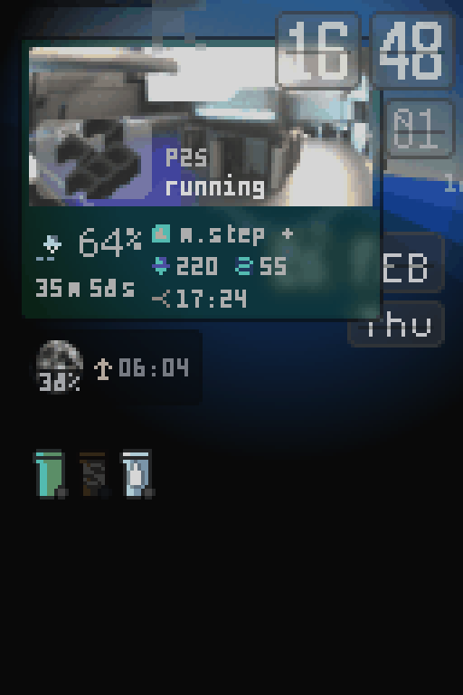

📸 [`disinfo-export.gif`](https://github.com/prashnts/disinfo/blob/5d31841/assets/disinfo-export.gif) ([`5d31841`](https://github.com/prashnts/disinfo/commit/5d31841))

### Changed
- The Klipper printer card shows the camera, progress and temperatures ([`5d31841`](https://github.com/prashnts/disinfo/commit/5d31841) … [`fe79566`](https://github.com/prashnts/disinfo/commit/fe79566)).

## [2026.02.21] - Portrait layout, Home Assistant over WebSocket

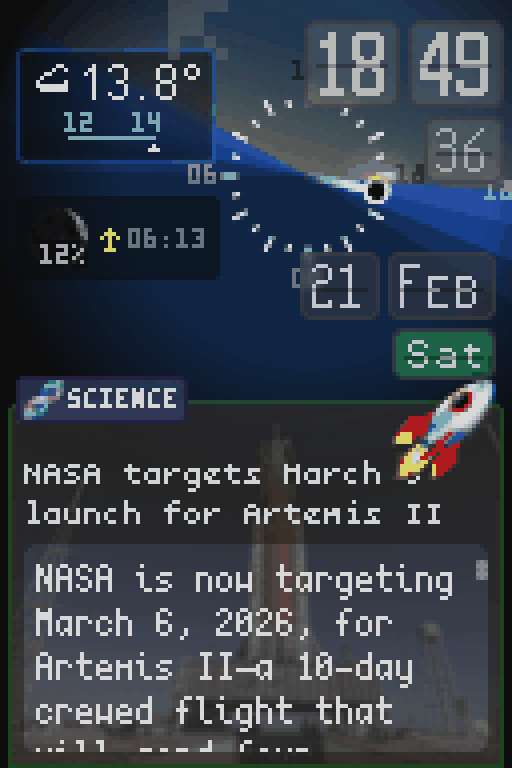

📸 [`disinfo-export.gif`](https://github.com/prashnts/disinfo/blob/5783f4a/assets/disinfo-export.gif) ([`5783f4a`](https://github.com/prashnts/disinfo/commit/5783f4a)), the first export of the 128×192 portrait panel.

### Changed
- Home Assistant over WebSocket (`utils/hass.py`). Weather comes from HA instead of Pirate Weather ([`d209b65`](https://github.com/prashnts/disinfo/commit/d209b65)).
- News: better shuffle, longer display per story, Kagi errors handled ([`e0363b4`](https://github.com/prashnts/disinfo/commit/e0363b4), [`6861753`](https://github.com/prashnts/disinfo/commit/6861753), [`bd67ce4`](https://github.com/prashnts/disinfo/commit/bd67ce4)).
- `mlx` added ([`fdcda78`](https://github.com/prashnts/disinfo/commit/fdcda78)).

## [2025.11.16] - WebSocket panels, remote, frost

No screenshot for this period.

### Added
- 🔧 **WebSocket HUB75 client** (`clients/websocket_rpi_matrix`) ([`28dfd37`](https://github.com/prashnts/disinfo/commit/28dfd37), [`a526c80`](https://github.com/prashnts/disinfo/commit/a526c80) … [`be16db6`](https://github.com/prashnts/disinfo/commit/be16db6)):
  - The panel's Pi fetches frames from the server, which can now run in a VM or container, over WSS.
  - The second salon panel, `di2_salon`, is the 128×192 portrait display.
- 🔧 **Remote with sensors** (`di_remote.py`, gestures), with telemetry sent back to the server (`web/telemetry.py`) ([`88bd3cb`](https://github.com/prashnts/disinfo/commit/88bd3cb) … [`b36c371`](https://github.com/prashnts/disinfo/commit/b36c371)).
- 🔧 Modulino support in the client (buzzer), and a timer app ([`3ef0228`](https://github.com/prashnts/disinfo/commit/3ef0228), [`ba9bb63`](https://github.com/prashnts/disinfo/commit/ba9bb63)).
- MJPEG stream widget ([`9dd58d4`](https://github.com/prashnts/disinfo/commit/9dd58d4)), with locking and timeouts for the stream ([PR #3](https://github.com/prashnts/disinfo/pull/3), [`4c3b228`](https://github.com/prashnts/disinfo/commit/4c3b228)).
- Flip clock ([`931a5f7`](https://github.com/prashnts/disinfo/commit/931a5f7) … [`fe38ad7`](https://github.com/prashnts/disinfo/commit/fe38ad7)).
- "Liquid glass" frosted cards ([`e334f13`](https://github.com/prashnts/disinfo/commit/e334f13) … [`15eb099`](https://github.com/prashnts/disinfo/commit/15eb099)).
- News app ([`e464357`](https://github.com/prashnts/disinfo/commit/e464357)). Quickstart ([`599af1f`](https://github.com/prashnts/disinfo/commit/599af1f)). Web UI ([`7d198ac`](https://github.com/prashnts/disinfo/commit/7d198ac) … [`e92cac4`](https://github.com/prashnts/disinfo/commit/e92cac4)).

### Fixed
- Lag and stability on the new panels ([`f6dad31`](https://github.com/prashnts/disinfo/commit/f6dad31) … [`7301700`](https://github.com/prashnts/disinfo/commit/7301700)).

## [2025.07.28] - Printers, motion, e-paper

No screenshot for this period.

### Added
- Bambu printers through Home Assistant ([`62293b6`](https://github.com/prashnts/disinfo/commit/62293b6) … [`2b4325f`](https://github.com/prashnts/disinfo/commit/2b4325f)).
- 🔧 E-paper test on an M5Paper (`disinfo/epd/m5paper.py`, [`8fb4ae4`](https://github.com/prashnts/disinfo/commit/8fb4ae4)).
- 🔧 Ambient light sensor curve ([`f7ec816`](https://github.com/prashnts/disinfo/commit/f7ec816)) and a new presence sensor ([`cf0f6e0`](https://github.com/prashnts/disinfo/commit/cf0f6e0)).
- Off state ([`159498b`](https://github.com/prashnts/disinfo/commit/159498b)).

### Changed
- Motion handling ([`1fbe3a4`](https://github.com/prashnts/disinfo/commit/1fbe3a4) … [`aeea7b4`](https://github.com/prashnts/disinfo/commit/aeea7b4)). A reliable sensor removes the wake-up lag ([`ce9afe4`](https://github.com/prashnts/disinfo/commit/ce9afe4)).

## [2025.02.07] - Shazam and the card stack

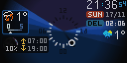

📸 [`export-02.gif`](https://github.com/prashnts/disinfo/blob/8925660/assets/export-02.gif) ([`8925660`](https://github.com/prashnts/disinfo/commit/8925660))

### Added
- Shazam service: songs playing in the room are recognised, with an indicator ([`7e7df28`](https://github.com/prashnts/disinfo/commit/7e7df28) … [`90b3607`](https://github.com/prashnts/disinfo/commit/90b3607)).
- The card stack: widgets register themselves and transition in and out ([`21620e8`](https://github.com/prashnts/disinfo/commit/21620e8) … [`84942a8`](https://github.com/prashnts/disinfo/commit/84942a8)).
- New clock ([`3b095a2`](https://github.com/prashnts/disinfo/commit/3b095a2)). Real temperature ([`2c3675f`](https://github.com/prashnts/disinfo/commit/2c3675f)).

## [2024.07.30] - Pico W panels, aviator

No screenshot for this period.

### Added
- 🔧 **Panels driven by Pico W boards over UDP**: `pico-study`, `pico-3dpanel`, and `pico-salon-a`/`-b`, with the salon split into two 64×64 halves ([`3434318`](https://github.com/prashnts/disinfo/commit/3434318) … [`534c65d`](https://github.com/prashnts/disinfo/commit/534c65d)). The brightness curve was updated to match ([`bc34cac`](https://github.com/prashnts/disinfo/commit/bc34cac) … [`be5cb5c`](https://github.com/prashnts/disinfo/commit/be5cb5c)).
- Aviator: ADS-B Exchange flights overhead, with aircraft icons, flags and a radar map ([`40bc293`](https://github.com/prashnts/disinfo/commit/40bc293) … [`a9829ec`](https://github.com/prashnts/disinfo/commit/a9829ec), [`2a16cf7`](https://github.com/prashnts/disinfo/commit/2a16cf7), [`4103e2b`](https://github.com/prashnts/disinfo/commit/4103e2b) … [`fe7507a`](https://github.com/prashnts/disinfo/commit/fe7507a)).
- Klipper panel, with ETA ([`125f22f`](https://github.com/prashnts/disinfo/commit/125f22f) … [`65ef142`](https://github.com/prashnts/disinfo/commit/65ef142), [`f7495e6`](https://github.com/prashnts/disinfo/commit/f7495e6)).
- Sleep screen ([`0f53887`](https://github.com/prashnts/disinfo/commit/0f53887)). The dishwasher is detected automatically ([`aa54faf`](https://github.com/prashnts/disinfo/commit/aa54faf) … [`eb251d9`](https://github.com/prashnts/disinfo/commit/eb251d9)).

### Changed
- Less data used ([`c9a28e6`](https://github.com/prashnts/disinfo/commit/c9a28e6)).

## [2024.04.13] - Appliances

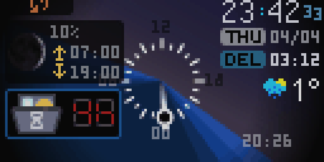

📸 [`export-01.gif`](https://github.com/prashnts/disinfo/blob/2b01825/assets/export-01.gif) ([`2b01825`](https://github.com/prashnts/disinfo/commit/2b01825))

### Added
- Dishwasher card with a segment display ([`a24f7c9`](https://github.com/prashnts/disinfo/commit/a24f7c9) … [`9b4d369`](https://github.com/prashnts/disinfo/commit/9b4d369)).
- 🔧 A `frekvens` renderer that sends frames over MQTT ([`a24f7c9`](https://github.com/prashnts/disinfo/commit/a24f7c9)).
- 🔧 Washing machine detector, for the 3D panel ([PR #1](https://github.com/prashnts/disinfo/pull/1), [`8515c7c`](https://github.com/prashnts/disinfo/commit/8515c7c), 2024-04-21).

## [2023.11.23] - Transitions, trash schedule, card stack, web UI

No screenshot for this period.

### Added
- Transitions and easing ([`6f2c371`](https://github.com/prashnts/disinfo/commit/6f2c371) … [`20d5a2c`](https://github.com/prashnts/disinfo/commit/20d5a2c)).
- Trash collection schedule ([`cad3935`](https://github.com/prashnts/disinfo/commit/cad3935) … [`7517209`](https://github.com/prashnts/disinfo/commit/7517209)).
- First card stack ([`b494ea7`](https://github.com/prashnts/disinfo/commit/b494ea7) … [`1fe3641`](https://github.com/prashnts/disinfo/commit/1fe3641)). Web UI ([`2518778`](https://github.com/prashnts/disinfo/commit/2518778) … [`5f0eb98`](https://github.com/prashnts/disinfo/commit/5f0eb98)).
- 🔧 Panel gamma ([`a429ba5`](https://github.com/prashnts/disinfo/commit/a429ba5)).

### Changed
- Presence and lux sensors migrated to Home Assistant ([`9fb3dd8`](https://github.com/prashnts/disinfo/commit/9fb3dd8) … [`e58d8c3`](https://github.com/prashnts/disinfo/commit/e58d8c3)).

## [2023.09.13] - Spectra temperature graph

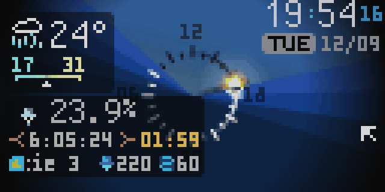

📸 [`disinfo-export.gif`](https://github.com/prashnts/disinfo/blob/5410918/assets/disinfo-export.gif) ([`5410918`](https://github.com/prashnts/disinfo/commit/5410918))

### Changed
- The temperature graph uses the spectra colour scale ([`5410918`](https://github.com/prashnts/disinfo/commit/5410918)). The OctoPrint card was repositioned ([`632e109`](https://github.com/prashnts/disinfo/commit/632e109)).

## [2023.09.09] - Solar clock

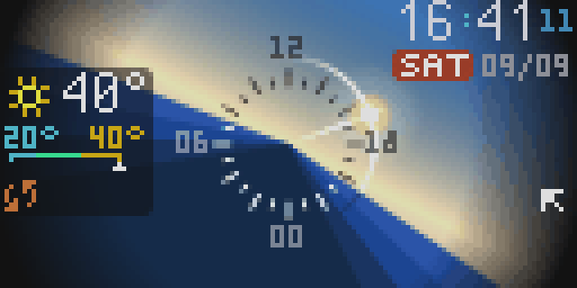

📸 [`disinfo-export.gif`](https://github.com/prashnts/disinfo/blob/a90b48c/assets/disinfo-export.gif) ([`a90b48c`](https://github.com/prashnts/disinfo/commit/a90b48c))

### Added
- **Solar clock**: a 24 h dial with the sun on its path, day and night sky, and a background that reacts ([`351d211`](https://github.com/prashnts/disinfo/commit/351d211) … [`ff2e281`](https://github.com/prashnts/disinfo/commit/ff2e281)).
- Moon phase and sunrise/sunset ([`3caaa57`](https://github.com/prashnts/disinfo/commit/3caaa57) … [`d56babe`](https://github.com/prashnts/disinfo/commit/d56babe)).
- 🔧 Web server, so displays can connect to it, with remote buttons in the web page ([`8a33b75`](https://github.com/prashnts/disinfo/commit/8a33b75), [`3203fa4`](https://github.com/prashnts/disinfo/commit/3203fa4)). Install script ([`7850b70`](https://github.com/prashnts/disinfo/commit/7850b70)).
- Redesigned date and time ([`b0706b7`](https://github.com/prashnts/disinfo/commit/b0706b7) … [`4902194`](https://github.com/prashnts/disinfo/commit/4902194)). New fonts and metro logic ([`76b87b5`](https://github.com/prashnts/disinfo/commit/76b87b5), [`01dcefa`](https://github.com/prashnts/disinfo/commit/01dcefa)).

### Changed
- State moves over Redis pub/sub (sensors, weather, metro), and almost all sync Redis calls are gone ([`d60476c`](https://github.com/prashnts/disinfo/commit/d60476c) … [`712810e`](https://github.com/prashnts/disinfo/commit/712810e)). Pydantic 2 ([`d6aeec9`](https://github.com/prashnts/disinfo/commit/d6aeec9)).

## [2023.06.29] - Styled text, divs, `disinfo`

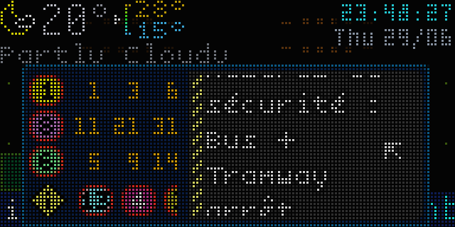

📸 [`disinfo-export.gif`](https://github.com/prashnts/disinfo/blob/3bcf426/assets/disinfo-export.gif) ([`3bcf426`](https://github.com/prashnts/disinfo/commit/3bcf426))

### Added
- Typed state managers ([`3726cec`](https://github.com/prashnts/disinfo/commit/3726cec)). Styled text ([`3080282`](https://github.com/prashnts/disinfo/commit/3080282)). Divs with real rounded corners ([`10c69fe`](https://github.com/prashnts/disinfo/commit/10c69fe), [`c380b31`](https://github.com/prashnts/disinfo/commit/c380b31)). A transition manager for visibility ([`eccac70`](https://github.com/prashnts/disinfo/commit/eccac70)).
- 🔧 RGB matrix emulator, for development without the panel ([`9366994`](https://github.com/prashnts/disinfo/commit/9366994)).

### Changed
- The module was renamed from `disp_info` to `disinfo` ([`4abdc13`](https://github.com/prashnts/disinfo/commit/4abdc13)), along with `hstack`/`vstack`/`mosaic` ([`8a1be79`](https://github.com/prashnts/disinfo/commit/8a1be79)).

## [2023.05.30] - Metro disruptions, Pi 4

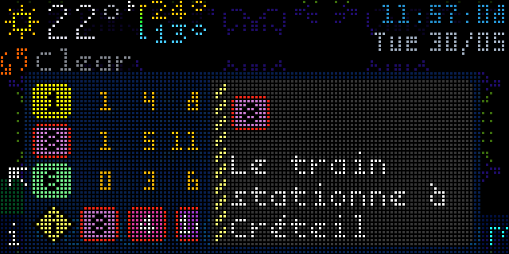

📸 [`disinfo-export.gif`](https://github.com/prashnts/disinfo/blob/0ebe7a8/assets/disinfo-export.gif) ([`0ebe7a8`](https://github.com/prashnts/disinfo/commit/0ebe7a8))

### Added
- Metro disruption messages in multiline text that scrolls when full, with a warning line ([`a5fcc97`](https://github.com/prashnts/disinfo/commit/a5fcc97) … [`c239afc`](https://github.com/prashnts/disinfo/commit/c239afc)).
- Unified state and a debug UI ([`1cbda9f`](https://github.com/prashnts/disinfo/commit/1cbda9f), [`b2a61ed`](https://github.com/prashnts/disinfo/commit/b2a61ed)).
- 🔧 **Raspberry Pi 4** ([`54e57b9`](https://github.com/prashnts/disinfo/commit/54e57b9)), with threaded drawing ([`1be49a8`](https://github.com/prashnts/disinfo/commit/1be49a8) … [`6325e79`](https://github.com/prashnts/disinfo/commit/6325e79)).

## [2023.05.27] - GIF renderer, auto brightness

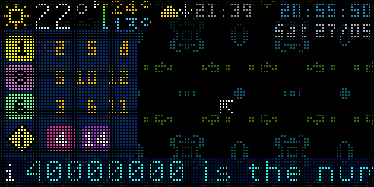

📸 [`disinfo-export.gif`](https://github.com/prashnts/disinfo/blob/766516d/assets/disinfo-export.gif) ([`766516d`](https://github.com/prashnts/disinfo/commit/766516d)). Same day: [`8c58830`](https://github.com/prashnts/disinfo/commit/8c58830), [`2af30bd`](https://github.com/prashnts/disinfo/commit/2af30bd), [`297bfa5`](https://github.com/prashnts/disinfo/commit/297bfa5), [`c9b01f7`](https://github.com/prashnts/disinfo/commit/c9b01f7); and [`85c0e79`](https://github.com/prashnts/disinfo/commit/85c0e79), [`1cbda9f`](https://github.com/prashnts/disinfo/commit/1cbda9f) the next day.

### Added
- **GIF renderer** ([`8c58830`](https://github.com/prashnts/disinfo/commit/8c58830)): the canvas, exported as these milestone GIFs.
- 🔧 Auto brightness from the light sensor ([`d4d7f29`](https://github.com/prashnts/disinfo/commit/d4d7f29)), with a scipy-interpolated curve ([`fefe758`](https://github.com/prashnts/disinfo/commit/fefe758)).
- Multicolour "resonant" Game of Life backgrounds ([`e91cc9b`](https://github.com/prashnts/disinfo/commit/e91cc9b) … [`9ec220a`](https://github.com/prashnts/disinfo/commit/9ec220a)).

### Changed
- Source reorganised into components, screens and renderers ([`4e4f7de`](https://github.com/prashnts/disinfo/commit/4e4f7de) … [`c611bd1`](https://github.com/prashnts/disinfo/commit/c611bd1)).

## [2023.05.20] - Game of Life, Paris Metro, now playing

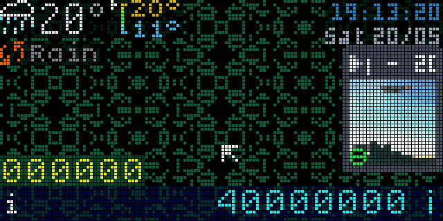

📸 [`demo.png`](https://github.com/prashnts/disinfo/blob/1fd7861/assets/demo.png) ([`1fd7861`](https://github.com/prashnts/disinfo/commit/1fd7861))

### Added
- 🔧 Home Assistant and MQTT services, PIR motion wake-up, and remote input ([`7a73c93`](https://github.com/prashnts/disinfo/commit/7a73c93), [`11504b8`](https://github.com/prashnts/disinfo/commit/11504b8), [`2994481`](https://github.com/prashnts/disinfo/commit/2994481), [`db1158a`](https://github.com/prashnts/disinfo/commit/db1158a)). A second remote ([`4f5ccc6`](https://github.com/prashnts/disinfo/commit/4f5ccc6)).
- Now playing, with dithered album art ([`75c8622`](https://github.com/prashnts/disinfo/commit/75c8622), [`add4c03`](https://github.com/prashnts/disinfo/commit/add4c03)).
- Temperature graph ([`491c403`](https://github.com/prashnts/disinfo/commit/491c403)). 3D printer status from OctoPrint ([`7797e75`](https://github.com/prashnts/disinfo/commit/7797e75)). Plant info ([`a2a78cf`](https://github.com/prashnts/disinfo/commit/a2a78cf)).
- Paris Metro lines and timings ([`944ba43`](https://github.com/prashnts/disinfo/commit/944ba43), [`d4d5c40`](https://github.com/prashnts/disinfo/commit/d4d5c40)).
- Game of Life background ([`d6999ea`](https://github.com/prashnts/disinfo/commit/d6999ea)).
- 🔧 FIFO renderer for several panels ([`a84c283`](https://github.com/prashnts/disinfo/commit/a84c283), [`dad163e`](https://github.com/prashnts/disinfo/commit/dad163e)). FPS limit ([`ff3eab5`](https://github.com/prashnts/disinfo/commit/ff3eab5)).

## [2023.04.22] - First demo

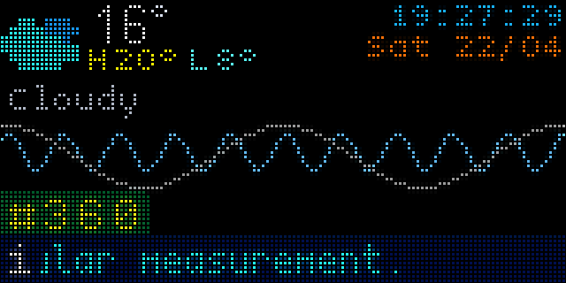

📸 [`demo.png`](https://github.com/prashnts/disinfo/blob/ebd6a9f/assets/demo.png) ([`ebd6a9f`](https://github.com/prashnts/disinfo/commit/ebd6a9f))

### Added
- 🔧 First code ([`6936c3c`](https://github.com/prashnts/disinfo/commit/6936c3c), 2023-04-12): weather and scrolling random facts, drawn with Pillow onto a HUB75 panel through [rpi-rgb-led-matrix](https://github.com/hzeller/rpi-rgb-led-matrix).
- Weather icons, hourly confetti, Scientifica font ([`812b482`](https://github.com/prashnts/disinfo/commit/812b482), [`069850c`](https://github.com/prashnts/disinfo/commit/069850c), [`cedd013`](https://github.com/prashnts/disinfo/commit/cedd013)).
- Data service run by supervisord, using a scheduler ([`3023a23`](https://github.com/prashnts/disinfo/commit/3023a23), [`a727036`](https://github.com/prashnts/disinfo/commit/a727036)).
- Sixel renderer, for development in the terminal ([`cb81597`](https://github.com/prashnts/disinfo/commit/cb81597)).

[Unreleased]: https://github.com/prashnts/disinfo/compare/299bdf0...llm-v1
[2026.08.15]: https://github.com/prashnts/disinfo/compare/5d31841...605e3ea
[2026.03.08]: https://github.com/prashnts/disinfo/compare/5783f4a...5d31841
[2026.02.21]: https://github.com/prashnts/disinfo/compare/60f0eda...5783f4a
[2025.11.16]: https://github.com/prashnts/disinfo/compare/fe583c0...60f0eda
[2025.07.28]: https://github.com/prashnts/disinfo/compare/8925660...fe583c0
[2025.02.07]: https://github.com/prashnts/disinfo/compare/fe7507a...8925660
[2024.07.30]: https://github.com/prashnts/disinfo/compare/2edbdf1...fe7507a
[2024.04.13]: https://github.com/prashnts/disinfo/compare/78a8898...2b01825
[2023.11.23]: https://github.com/prashnts/disinfo/compare/5410918...78a8898
[2023.09.13]: https://github.com/prashnts/disinfo/compare/a90b48c...5410918
[2023.09.09]: https://github.com/prashnts/disinfo/compare/3bcf426...a90b48c
[2023.06.29]: https://github.com/prashnts/disinfo/compare/0ebe7a8...3bcf426
[2023.05.30]: https://github.com/prashnts/disinfo/compare/766516d...0ebe7a8
[2023.05.27]: https://github.com/prashnts/disinfo/compare/1fd7861...766516d
[2023.05.20]: https://github.com/prashnts/disinfo/compare/ebd6a9f...1fd7861
[2023.04.22]: https://github.com/prashnts/disinfo/compare/6936c3c...ebd6a9f
