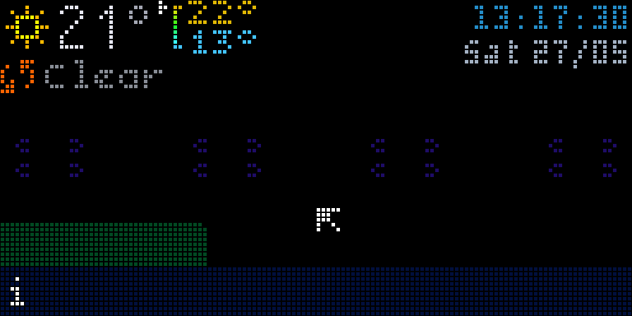
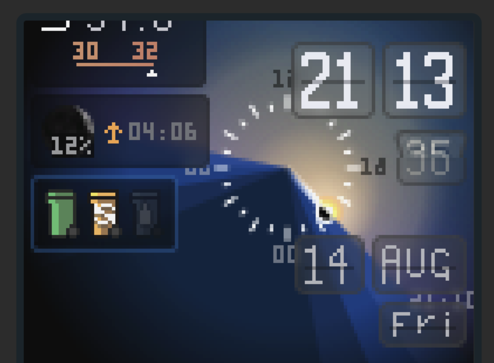

## disinfo: it (dis)plays (info)rmation

Like many, I wanted to make my own LED Matrix dashboard to see some information
at a glance. This is my attempt. I leveraged an 
[excellent open-source library](https://github.com/hzeller/rpi-rgb-led-matrix) to,
as a step zero, display something on a HUB75 64x64px display.

Next, I needed some software to actually display the content. Initial survey
shows approaches where:

- we could make a webpage and cast it to the display
- manually place each pixel on the screen using primitives (Pillow)
- use lvgl/embedded code to draw directly on the hardware itself
- have a server-listener structure where full image frames are broadcasted (like a TV)

`disinfo` chooses to go with the last option. It's implemented where the display
does not generate the frames it shows, rather it fetches them from a server through
a WebSocket connection. This connection also allows the display to send some
information back to the server -- termed `telemetry`. This allows the display to
feature buttons, sensors, or actuators optionally.



Other methods are also available, such as multicast UDP or running the server on
the same Pi as the display. They are all good to a certain degree,
but with a WebSocket connection we get TLS/WSS support and even run the server
in a VM/container.

Apart from connection, `disinfo` also builds on top of low-level graphics libraries such as
`pillow` and `cairo` to introduce a more declarative method to write the code for
each widget, with inspiration from Web Standards and React.

The application is multi-threaded in order to maintain visual performance. There
is a central "composer" which composes a final image to be shown on the screen,
but it does not contain or directly control the widgets themselves.

The core components include layout, text, and transitions. The UI is immediate-mode
but some caching and metaclass magic allow us to control the resources. The graphics
API is comprehensive.

Data flows between different processes through the Redis PubSub event system.
Practically this means that a single webserver process can host multiple
independent screens individually.

**The code snippet below shows how we program disinfo**. It renders a trash-bin
icons based on the schedule. Each function that appears below such
as `hstack`, `div` does what you'd expect -- instead of manually positioning the three
trash-bin icons we're leveraging declarative composition. The `tag` at the end is
an internal detail from the `Frame` class because it (ab)uses the Python `__hash__`.
Don't worry about it!

The class `Widget` is a container and declares that the component can be shown on
the "Stack" of cards and is what's "registered" in the `compositor.py`. It has auto
transitions for appear-disappear states.

In the end it's simply a Python DSL, but I've done my best to simplify it. Here's what gets rendered:



```python
SCHEDULE = [
    # https://www.paris.fr/pages/la-collecte-44
    {
        'type': 'green',
        'icon': StillImage('assets/raster/trash-bin-green-10x14.png'),
        'days': [0, 1, 2, 3, 4, 5, 6],
    },
    {
        'type': 'yellow',
        'icon': StillImage('assets/raster/trash-bin-yellow-10x14.png'),
        'days': [2, 4, 6],
    },
    {
        'type': 'white',
        'icon': StillImage('assets/raster/trash-bin-white-10x14.png'),
        'days': [3],
    },
]

def todays_trash_schedule(fs: FrameState):
    today = fs.now.day_of_week
    for s in SCHEDULE:
        yield s['icon'].opacity(0.4 if today not in s['days'] else 1)

def composer(fs: FrameState):
    if not is_visible(fs):
        return

    schedules = hstack(list(todays_trash_schedule(fs)), gap=2)

    return div(
        schedules,
        style=DivStyle(padding=1)
    ).tag('trash_pickup')

def widget(fs: FrameState):
    return Widget('trash_pickup', composer(fs), priority=0.5)

```

In its current state it is sufficient to run (and modify) `maindev.py`.
It runs the whole stack you'd need for local development.

```
uv run maindev.py
```

[!Note]
You may want to work on a fork -- the code will certainly need
to be modified to fit your needs. I can assist only with getting it to run,
you still need to build the displays and be ready for some debugging.


---


Lots of things are currently undocumented and unstable.

Connections:

- Homeassistant (over Websocket (ongoing))
- Numbers API
- IDFM (Paris Metro)
- Kagi News

Hardware:

- 6x HUB75 RGB LED Matrix 64x64
- Raspberry Pi 4B
- Adafruit Matrix Bonnet
- Interface to connect the matrix to GPIOs
- Power Supply

Refer to rgb-led-matrix library for details.

Notes:

- We use `uv` as the package manager. Additional dependencies for cairo and others would require system packages.
- A demo/dev script is available to start the whole stack:
    `uv run maindev.py`
- The following command also sets up an auto-reload dev env:
    `uv run watchmedo auto-restart -d disinfo -d clients -d assets --patterns="*.py"  --recursive -- uv run maindev.py`
- The websocket client in clients/ dir is what runs on the Raspberry Pi. A supervisor config handles runtime.
- We use [rpi-rgb-led-matrix](https://github.com/hzeller/rpi-rgb-led-matrix) to communicate with the panels, and there is a vast documentation available there.
- Fonts are collected from various sources and accompany the licenses.


HUB75 Connections to Pi

```
MATRIX  PIN       GPIO
strobe  7         4
clock   11        17

G1      13        27
G2      21        9
R1      23        11
R2      24        8
B1      26        7
B2      19        10

A       15        22
B       16        23
C       18        24
D       22        25
E       10        15

OE      12        18
```

[notes] Setup RPI from scratch

- Assuming a fresh minimal install.
- Set `isolcpus=3` in cmdline.txt at the end.
- Set `dtparam=audio=off` in config.txt


- check disk speed with `sudo hdparm -Tt /dev/sda` (install hdparm first)
- with dd `dd if=/dev/zero of=/tmp/output bs=8k count=10k; rm -f /tmp/output`


### macOS Setup (manual)

- Install pyenv, redis, libsixel, cairo from brew.
- Ensure libsixel can be found -- `sudo ln -s /opt/homebrew/lib /usr/local/lib` -- on macos with apple silicon

- `watchmedo auto-restart -d disinfo -d assets --patterns="*.py;*.png;*.bdf;*.ttf" --recursive -- python -m disinfo.renderers.sixel --fps 42`

- `uvicorn disinfo.web.server:app --host 0.0.0.0 --port 4200 --reload` -- run a local server showing the screen.
- `watchmedo auto-restart -d disinfo -d assets --patterns="*.py;*.png;*.bdf;*.ttf" --recursive -- python -m disinfo.renderers.background --fps 25` -- to feed the webpage.